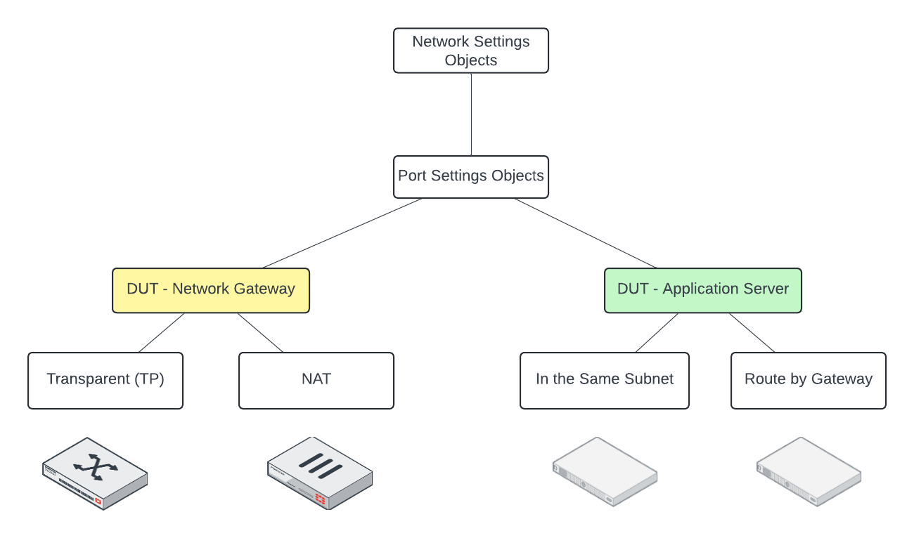
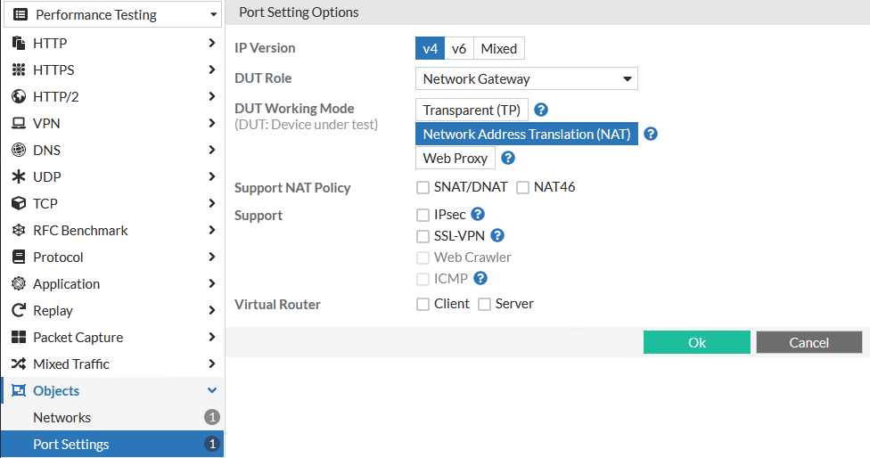
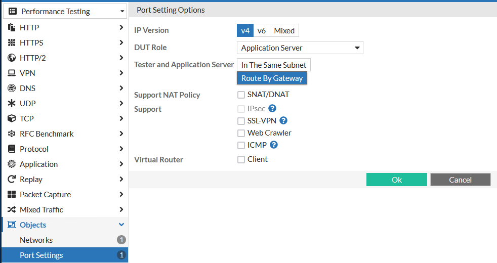
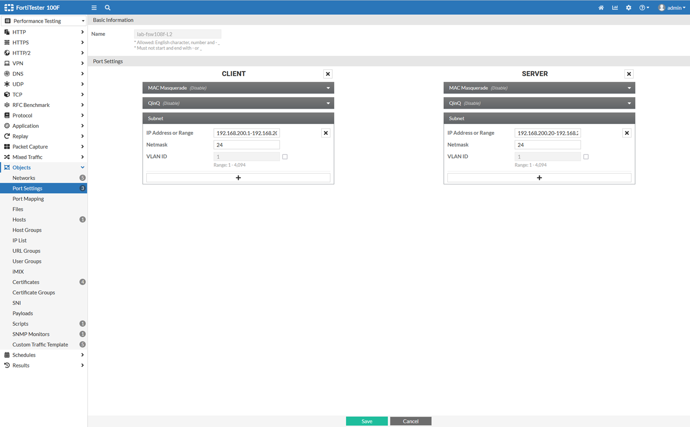
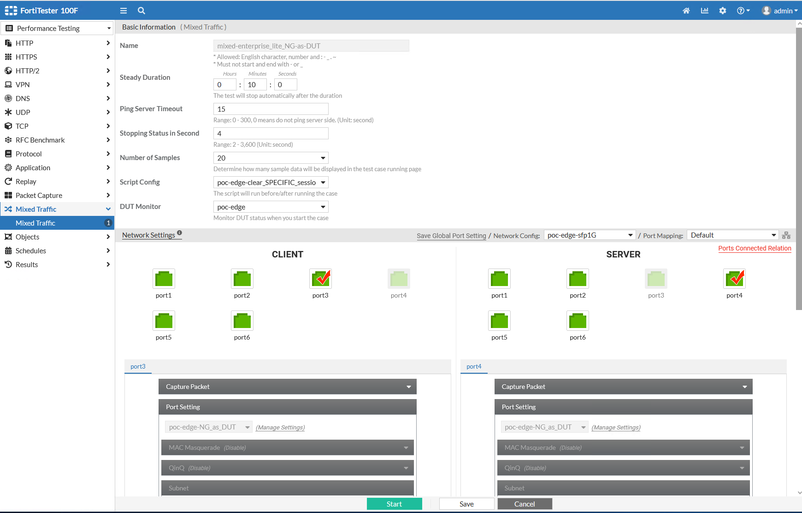

# FortiTester Kickstart

* [Detailed list of FortiTester Functions](https://docs.fortinet.com/document/fortitester/7.4.1/administration-guide/839782/features-and-benefits)
* [FortiTester Admin Guide](https://docs.fortinet.com/document/fortitester/7.4.1/administration-guide/452052/introduction)

## Basic Setup Instructions

1. Unbox, rack, and power-on the appliance
2. Connect the MGMT port to a laptop on the 192.168.1.0/24 network
    * Default address of the FTS appliance is https://192.168.1.99
    * Default username is 'admin' with no password, it will prompt you to create a password after first login
3. Connect the console port to your normal Out of Band (OOB) solution like a Lantronix or OpenGear Console Server
    * Default console port settings are 9600/8/N/1/None
4. From the Status Dashboard, we're going to change:
    * Hostname
    * System Timezone and NTP Settings
5. `Network > Interface` to set either a static IP or use DHCP
    * Under DNS, either go with the default DNS servers from FortiGuard, or change them to internal DNS servers
6. Logout, re-cable the MGMT interface to your production management network, and log back into the  using the IP address you either assigned or received from step 5 above.
7. `System > Setting` to review and possibly increase the 'Idle Timeout' and change the appliance GUI certificate
8. `System > FortiGuard` to update the firmware to the current version
9. `Log & Report` to configure a syslog server if you want FTS logs

### FortiTester Licensing

_Device registration is a two-step process through the Fortinet FortiCare support portal. You will need to register the device's __serial number__ in step one, and the __support contract__ in step two. The FortiTester device will use the management interface to contact FortiGuard to verify its' licensing status and retrieve any dynamic content updates._

### Reusable Object Relationships

### Common Port Settings

_Example settings when the Device Under Test will be a Network Gateway device like a Firewall, NGFW, Router, etc._

_Example settings when the Device Under Test will be an application server like a web server, DNS server, VPN gateway, etc._

1. `Performance Testing > Objects > Port Settings`
2. Create a new named object
3. Specify the IP Version, DUT Role, DUT Working Mode, and optional support features
4. Additional options for network definitions will appear depending on the options selected above.

### Layer 2 Network Object

_Notice that both the Client and Server subnets are in the same logical network_

1. `Performance Testing > Objects > Networks`
2. Create a new named object
    * _You can either select a saved Port Setting Object as created above, or manually specify network details as follows:_
3. On the __Client__ section:
    * Identify which NIC you want FTS to generate outbound traffic towards the DUT
    * Specify the network range that the FTS Client port will be participating in
    * Specify the peer network range that you expect to receive return traffic from (should mirror the __Server__ side network)
    * Make sure to remove any additional network subnets that may be defined
4. On the __Server__ section:
    * Identify which NIC you want FTS to expect inbound traffic from the DUT
    * Specify the network range that the FTS Server port will be participating in
    * Specify the peer network range that you expect to receive return traffic from (should mirror the __Client__ side network)
    * Make sure to remove any additional network subnets that may be defined

### Layer 3 Network Object

1. `Performance Testing > Objects > Networks`
2. Create a new named object
    * _You can either select a saved Port Setting Object as created above, or manually specify network details as follows:_
3. On the __Client__ section:
    * Identify which NIC you want FTS to generate outbound traffic towards the DUT
    * Specify the network range that the FTS Client port will be participating in
    * Specify the peer network range that you expect to receive return traffic from (should mirror the __Server__ side network)
    * Make sure to remove any additional network subnets that may be defined
4. On the __Server__ section:
    * Identify which NIC you want FTS to expect inbound traffic from the DUT
    * Specify the network range that the FTS Server port will be participating in
    * Specify the peer network range that you expect to receive return traffic from (should mirror the __Client__ side network)
    * Make sure to remove any additional network subnets that may be defined

## FortiTester Standalone Mode Examples

_The Device Under Test (DUT) is typically a network infrastructure device like a switch, router, or firewall._

### Testing Layer 2 Switching Speeds (Frames)

[FTS Admin Guide Section](https://docs.fortinet.com/document/fortitester/7.4.1/administration-guide/703194/starting-an-rfc-2544-throughput-test)

1. `Performance Testing > RFC Benchmark > RFC 2544 > Throughput`
2. Create a new test and provide a name
3. Select the layer 2 network object created above
4. Click Ok
5. Configure test case options as desired
    * Important to note that the default test length (__Steady Duration__) is 10 minutes! Adjust as necessary
6. Click Start to launch the test case

### Testing Layer 3/4 Routing/Firewall Speeds (Packets)

* [FTS Admin Guide Section on IP Throughput](https://docs.fortinet.com/document/fortitester/7.4.1/administration-guide/817370/starting-an-rfc-3511-ip-throughput-test)
* [FTS Admin Guide Section on TCP Throughput](https://docs.fortinet.com/document/fortitester/7.4.1/administration-guide/686336/starting-a-tcp-throughput-test)

_Remember to setup your Device Under Test appropriately before configuring or launching tests with FortiTester_

1. `Performance Testing > RFC Benchmark > RFC 3511 > IP Throughput`
2. Create a new test and provide a name
3. Select the layer 3 network object created above
4. Click Ok
5. Configure test case options as desired
    * Important to note that the default test length (__Steady Duration__) is 10 minutes! Adjust as necessary
6. Click Start to launch the test case

### Testing Layer 7 NGFW/Firewall Speeds (Packets)

* [FTS Admin Guide Section on mix of Enterprise Traffic](https://docs.fortinet.com/document/fortitester/7.4.1/administration-guide/277268/starting-a-mixed-traffic-test)

1. `Performance Testing > Mixed Traffic`
2. Create a new test case
3. Select options for Traffic Mix, a pre-defined Traffic Template like Enterprise Lite or Enterprise, DUT Role, and Network Config
4. Specify the Upper Bandwidth Limit for the test and click Apply and then Ok
5. On the next screen, name the test, configure the test duration, and any scripts and/or DUT Monitors as needed
    * Verify the network settings as applied from the previous page
    * Adjust any specifics for Client side or Server side generated traffic, like MTU, MSS, etc.
6. When ready to launch the test, click Start