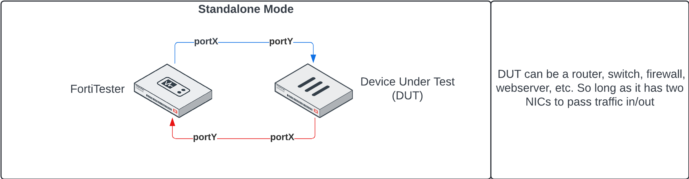
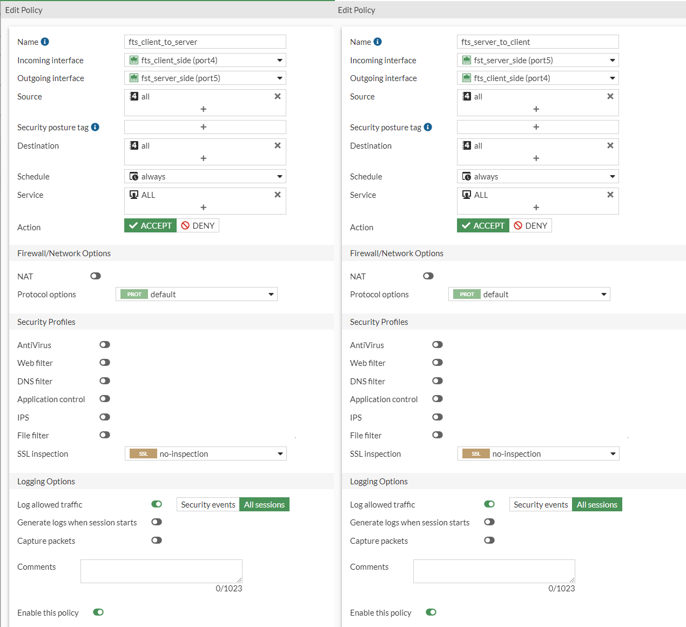

# FortiTester Kickstart

* [Detailed list of FortiTester Functions](https://docs.fortinet.com/document/fortitester/7.4.1/administration-guide/839782/features-and-benefits)
* [FortiTester Admin Guide](https://docs.fortinet.com/document/fortitester/7.4.1/administration-guide/452052/introduction)

## Basic Setup Instructions

1. Unbox, rack, and power-on the appliance
2. Connect the MGMT port to a laptop on the 192.168.1.0/24 network
    * Default address of the FTS appliance is https://192.168.1.99
    * Default username is 'admin' with no password, it will prompt you to create a password after first login
3. Connect the console port to your normal Out of Band (OOB) solution like a Lantronix or OpenGear Console Server
    * Default console port settings are 9600/8/N/1/None
4. From the Status Dashboard, we're going to change:
    * Hostname
    * System Timezone and NTP Settings
5. `Network > Interface` to set either a static IP or DHCP
    * Under DNS, either go with the defaults (FortiGuard) or change them to internal DNS servers
6. Logout, re-cable the MGMT interface to your production management network, and log back into the device
7. `System > Setting` to review and possibly increase the 'Idle Timeout' and change the appliance GUI certificate
8. `System > FortiGuard` to update the firmware to the current version 7.4.1
9. `Log & Report` to configure a syslog server if you want FTS logs

## Create Reusable Objects

### Layer 2 Network Object

1. `Performance Testing > Objects > Networks`
2. Create a new named object
3. On the __Client__ section:
    * Identify which NIC you want FTS to generate outbound traffic towards the DUT
    * Specify the network range that the FTS Client port will be participating in
    * Specify the peer network range that you expect to receive return traffic from (should mirror the __Server__ side network)
    * Make sure to remove any additional network subnets that may be defined
4. On the __Server__ section:
    * Identify which NIC you want FTS to expect inbound traffic from the DUT
    * Specify the network range that the FTS Server port will be participating in
    * Specify the peer network range that you expect to receive return traffic from (should mirror the __Client__ side network)
    * Make sure to remove any additional network subnets that may be defined

### Layer 3 Network Object

For this example, the __DUT Role__ will be set to __Network Gateway__ where the FortiTester will be sending client traffic towards the DUT on one port, and receiving return traffic from the DUT on a separate port, as illustrated in the diagram below:

1. `Performance Testing > Objects > Networks`
2. Create a new named object
3. On the __Client__ section:
    * Identify which NIC you want FTS to generate outbound traffic towards the DUT
    * Specify the network range that the FTS Client port will be participating in
    * Specify the peer network range that you expect to receive return traffic from (should mirror the __Server__ side network)
    * Make sure to remove any additional network subnets that may be defined
4. On the __Server__ section:
    * Identify which NIC you want FTS to expect inbound traffic from the DUT
    * Specify the network range that the FTS Server port will be participating in
    * Specify the peer network range that you expect to receive return traffic from (should mirror the __Client__ side network)
    * Make sure to remove any additional network subnets that may be defined

#### FortiTester Standalone Mode Examples

## Testing Layer 2 Switching Speeds (Frames)

[FTS Admin Guide Section](https://docs.fortinet.com/document/fortitester/7.4.1/administration-guide/703194/starting-an-rfc-2544-throughput-test)

1. `Performance Testing > RFC Benchmark > RFC 2544 > Throughput`
2. Create a new test and provide a name
3. Select the layer 2 network object created above
4. Click Ok
5. Configure test case options as desired
    * Important to note that the default test length (__Steady Duration__) is 10 minutes! Adjust as necessary
6. Click Start to launch the test case

## Testing Layer 3/4 Routing/Firewall Speeds (Packets)

[FTS Admin Guide Section](https://docs.fortinet.com/document/fortitester/7.4.1/administration-guide/817370/starting-an-rfc-3511-ip-throughput-test)

_Remember to evaluate (or setup) your Device Under Test appropriately before configuring FortiTester_

1. `Performance Testing > RFC Benchmark > RFC 3511 > IP Throughput`
2. Create a new test and provide a name
3. Select the layer 3 network object created above
4. Click Ok
5. Configure test case options as desired
    * Important to note that the default test length (__Steady Duration__) is 10 minutes! Adjust as necessary
6. Click Start to launch the test case

## Testing Layer 7 NGFW/Firewall Speeds (Packets)

1. 