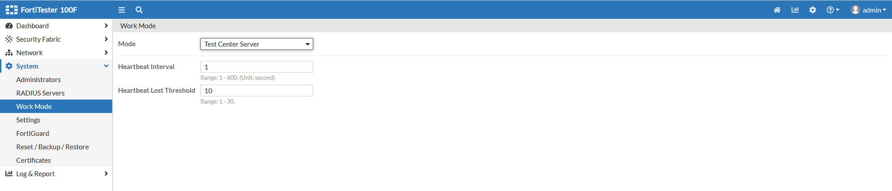

# FortiTester in Test Center Mode

* [FTS Admin Guide - Test Center Section](https://docs.fortinet.com/document/fortitester/7.4.3/administration-guide/957579/test-center)

## Purpose/Function of FTS in Test Center mode

* When network throughput exceeds what can be generated or received by a single FTS device

* When performing tests across disparate networks or physical locations

### Requirements

* All FortiTester devices need to be licensed
* All FortiTester devices need to be running the same major version of code
* FortiTester VM devices need to be of the same time, with the same number of vCPU, and vNICs
* FortiTester uses TCP/443, TCP/2002, TCP/2003 ports for heartbeats (helpful to know if you need to allow these ports on devices between the FTS devices)

### Setting System Work Mode

`System > Work Mode`

1. One unit will be the "server" where you will configure Performance Testing, Security Testing, or ATT&CK from:

2. The other unit will be the "client" that is linked back with the primary FTS server":

_After entering the FTS server IP address, the device will link itself to the server and remain connected until either you manually disconnect, the client device misses the number heartbeats defined originally on the FTS server side in step 1 above._

## Example of an Oracle Application Performance Test

_Important to note that the same port number is being used on both devices. You __can__ use multiple interfaces in port aggregation, but it __must__ be mirrored on the other FTS device._

