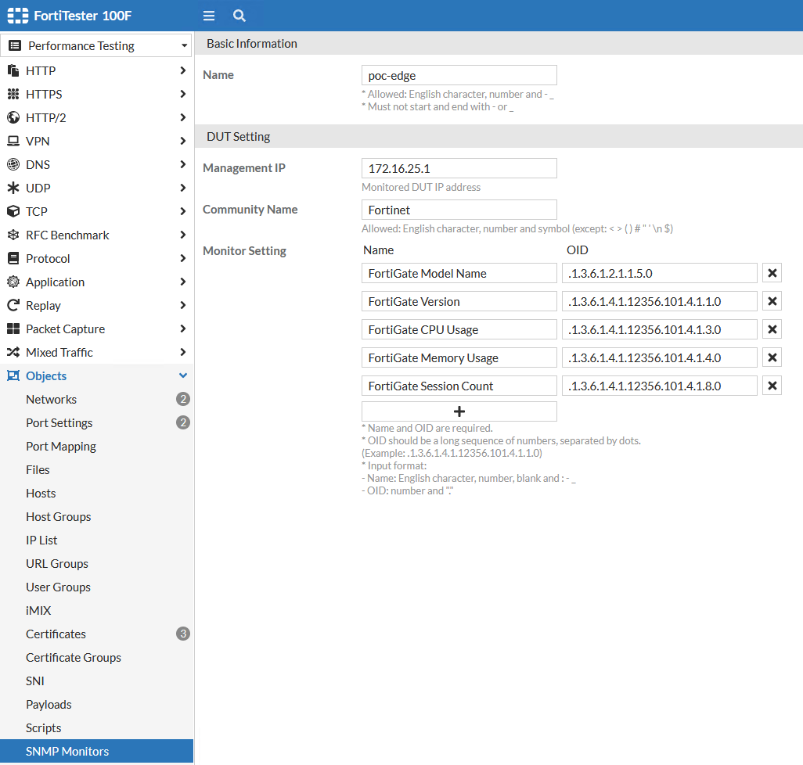
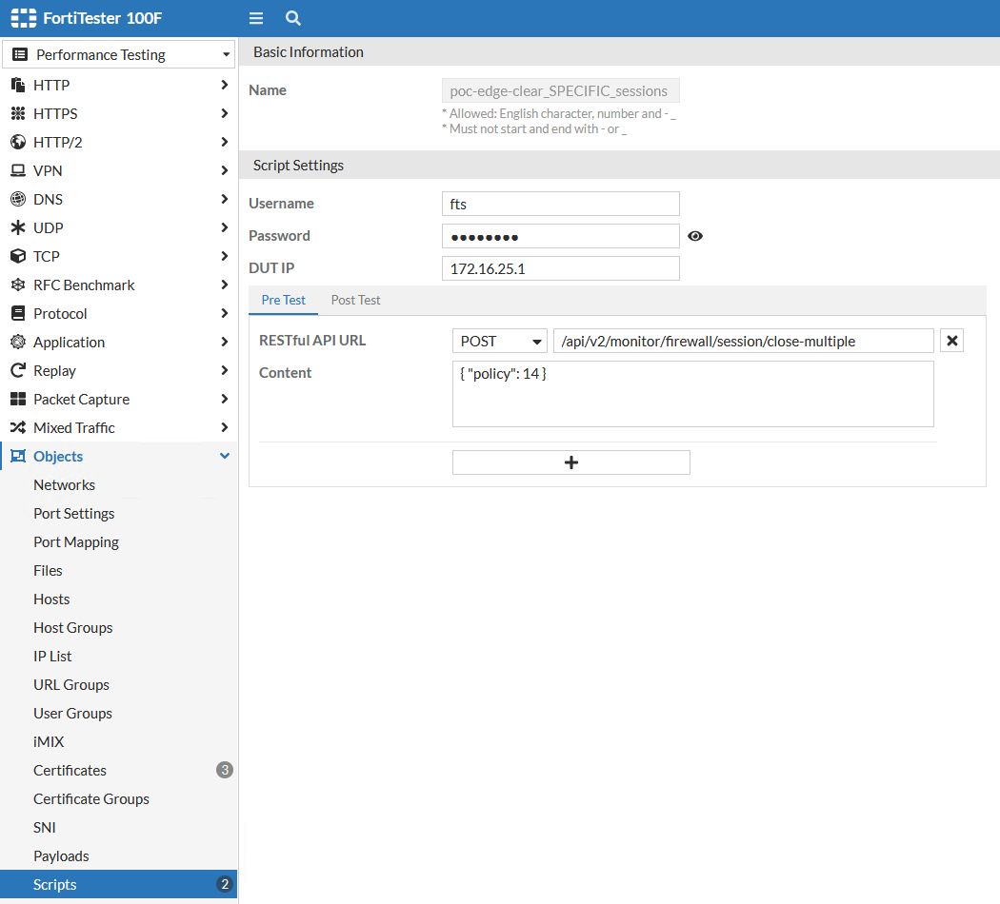
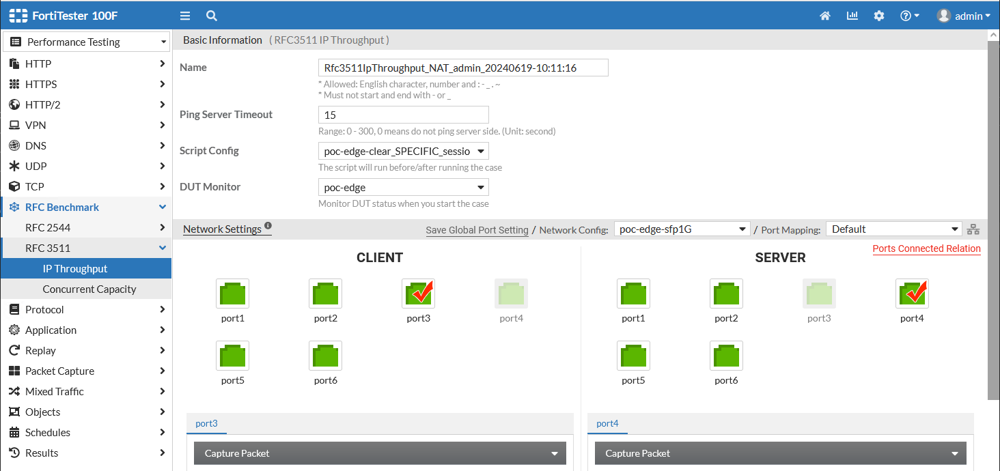

# Monitoring DUT & Pre/Post Test Scripting

## Configure an SNMP Monitor Object

_During a test, FortiTester can monitor the DUT via SNMP, (traffic gets sourced from the FTS Management Port). __Remember to configure the DUT to accept SNMP from the FTS.___



1. `Security/Performance Testing -> Objects -> SNMP Monitors`
2. Create a new named object for the DUT
3. Specify the DUT's Management IP and SNMP Community String
4. Specify which specific DUT SNMP OID's that you want to monitor

Fortinet, like many other cybersecurity and network vendors, provides MIB files for a variety of their products on their [Fortinet Customer Service & Support Portal](https://support.fortinet.com) under `Downloads > Firmware Images > <Product> > Download Tab > <Version> > MIB folder`. Alternatively, you can perform an SNMP walk against your Fortinet device to see what it returns as ISO registered objects.

### Common SNMP Objects to Monitor

```ruby
.1.3.6.1.2.1.1.5 - sysName
.1.3.6.1.2.1.1.3 - sysUptime
.1.3.6.1.2.1.1.1 - sysDescription
.1.3.6.1.2.1.47.1.2.1.1.2.1 - Fortinet Model & FortiOS Version
.1.3.6.1.4.1.12356.101.4.1.3.0 - fgSysCpuUsage - Current CPU Usage
.1.3.6.1.4.1.12356.101.4.1.4.0 - fgSysMemUsage - Current Memory Utilization
.1.3.6.1.4.1.12356.101.4.5.3.1.5 -fgProcModProcessorCount
.1.3.6.1.4.1.12356.101.4.5.3.1.6 - fgProcModMemCapacity
.1.3.6.1.4.1.12356.101.4.1.36 - .fgSysFreeMemUsage - Free Memory Utilization (may only be a v7.4.4)
.1.3.6.1.4.1.12356.101.4.1.37 - .fgSysFreeableMemUsage - Freeable Memory Utilization (may only be a v7.4.4)
.1.3.6.1.4.1.12356.101.4.1.8.0 - fgSysSesCount - Current Session Count
```

## Config a Script to Clear FortiGate Sessions

Performance and security testing can generate __A LOT__ of sessions against a network device as part of its normal processes. Most network devices will eventually age out stale sessions, but the timers may be up to 60 minutes by default in some cases! After concluding a performance or security test, it may make sense to clear the session table automatically. Be mindful that the commands below will clear the __ENTIRE__ session table. Consider filtering that appropriately.



1. `Security/Performance Testing -> Objects -> Scripts`
2. Create a new named script
3. Specify the Username, Password, and DUT Management IP address
4. Define the Pre-Test and/or Post-Test API Commands
    * POST /api/v2/monitor/firewall/session/clear_all/  # FOSv7.0.x specific
    * POST /api/v2/monitor/firewall/session/close-all/  # FOSv7.2.x specific
    * POST /api/v2/monitor/firewall/close-multiple      # Specify parameters (to define firewall policy)

### Example of a Performance Test with Monitor and Script



### API Endpoint Details

Can be found on [Fortinet's Developer Network (FNDN) site](https://fndn.fortinet.net)